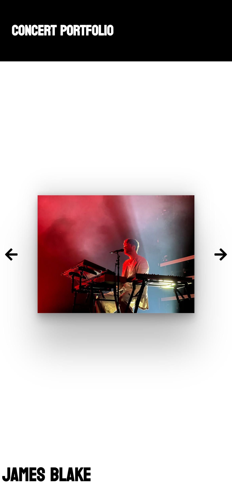

# Concert Photo Portfolio

## Description

Over the last few years, since my junior year in high school, I found great enjoyment in concerts. At these shows, I have taken plenty of great photos and videos.

Therefore, I decided to display my photos through the use of a website. I created this project with React, which helped me build experience. I found this project very enjoyable. In this project, I have the images displayed through a carousel, which one can view each image by clicking on the arrows to the left or to the right of the image. All of the concerts and events are all stored in array, therefore elements were generated depending on what is in the array.

The home page contains a grid for each event, which displays the name of the artist, date, and venue when hovering over the selection.

Each event has it's own page, displaying the date, venue, description, opening acts, and suprise guests. You can also view the carousel on these pages, which display images, along with GIFs to add personality and life to the page.

This website has provided me great practice with react by creating elements that are created by mapping arrays of objects. This project also helped me develop my skills in CSS, including animations and CSS Grid.

You can view the my website [here](https://johnclimie.github.io/concertportfolio/).
